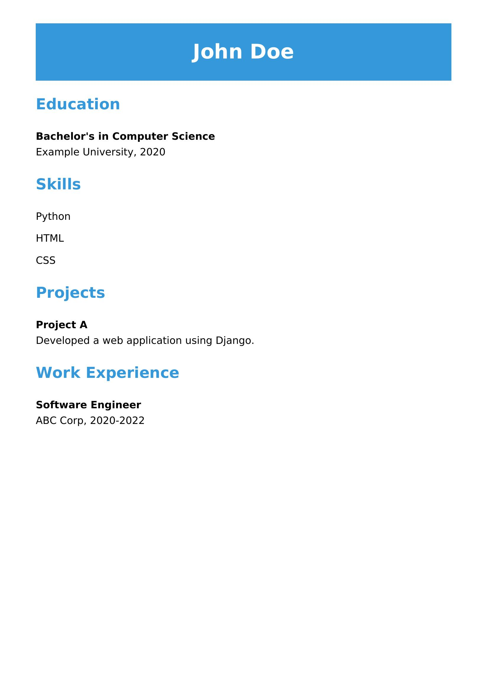

# Yaml-to-CV-generator
A project where user is required to provide a yaml containing their resume details and the python3 script will create a CV both html and pdf using jinja2 and pdfkit

A sample yaml input would look like following snippet

```yaml
name: John Doe
education:
  - degree: Bachelor's in Computer Science
    school: Example University
    year: 2020
skills:
  - Python
  - HTML
  - CSS
projects:
  - title: Project A
    description: Developed a web application using Django.
work_experience:
  - position: Software Engineer
    company: ABC Corp
    year: 2020-2022
```

Once you have your input_data.yaml ready you need to run the python script **resume_gen.py** in the same folder as you yaml container. Right now there is one one html format present - format 0. Soon user will be able to choose more formats from template maps.

Working it out pdfkit was a bit of a hassle for me, so I have written a blog in case you face error related to wkhtmltopdf. [blog-link-to-wkhtmltopdf-installation](https://dev.to/mintuagarwal/python-wkhtmltopdf-for-pdfkit-installation-guide-2745)

The data will be rendered into **resume_template.html** using jinja2 and the output should look somehting like below:

<a href='examples/outputs/pdfs/output_resume.pdf'>Output Resume </a>


